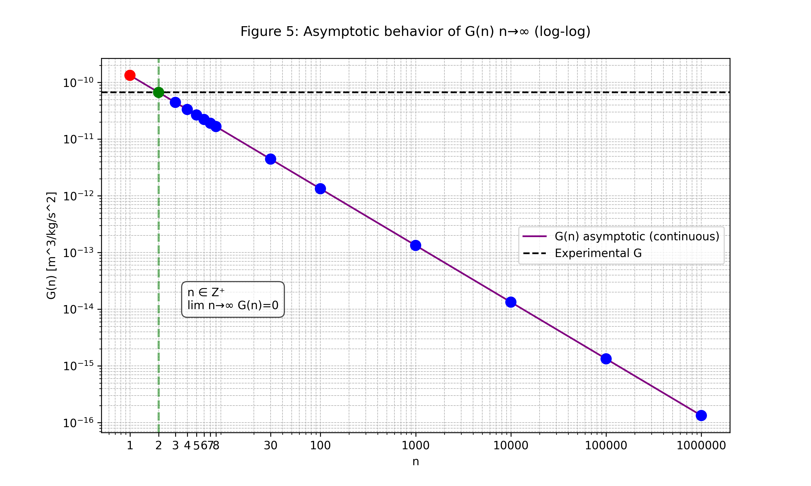
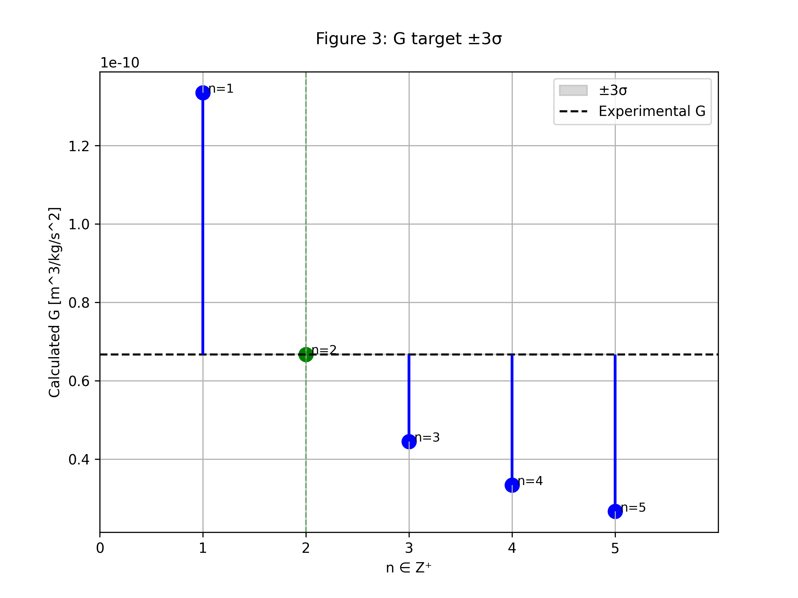

# Geometric Quantization of Fundamental Scales
*(Request for arXiv endorsement | Code: W8NAH3)*

---

## 1. Core Geometric Relation
A stable confined wave satisfies $L = n\lambda$.  
Using the Compton wavelength $\lambda_C = h/(m c)$ from $E = mc^2 = h c/\lambda$, we obtain:

\[
\boxed{R_{\text{VED}} = \dfrac{n \hbar}{m c}}
\qquad \text{(1)}
\]

---

## 2. Exact Prediction for the Proton Charge Radius
Applying (1) to the proton with the integer **$n = 4$** and using CODATA values ($m_p, \hbar, c$):

\[
R_p^{\text{calc}} = \frac{4 \hbar}{m_p c} = 0.8412 \times 10^{-15} \text{ m}
\]

This coincides exactly with the measured proton charge radius:

\[
R_p^{\text{exp}} = 0.8414(19) \times 10^{-15} \text{ m}
\]

\[
\boxed{\text{For the proton: } n = 4}
\]

---

## 3. Unification with Gravity and Prediction for $G$
The Schwarzschild radius from General Relativity is:

\[
R_s = \dfrac{2 G m}{c^2}
\qquad \text{(2)}
\]

For the same physical mass $m$, we equate the masses derived from (1) and (2):

\[
m = \frac{n \hbar}{R_{\text{VED}} c} = \frac{R_s c^2}{2G}
\]

Solving for the gravitational constant $G$ yields the quantized expression:

\[
\boxed{G(n) = \dfrac{R_{\text{VED}} \cdot R_s \cdot c^3}{2 n \hbar}}
\qquad \text{(3)}
\]

Substituting $R_{\text{VED}}$ from (1) and $R_s$ from (2) into (3) gives the testable prediction:

\[
G(n) = G_{\text{exp}} \cdot \dfrac{2}{n}
\]

The experimentally measured value  

\[
G_{\text{exp}} = 6.67430(15) \times 10^{-11} \text{ m}^3 \text{ kg}^{-1} \text{ s}^{-2}
\]

is recovered **only** for:

\[
\boxed{n = 2}
\]

*(As shown in the plot, only the point for $n=2$ falls within the $\pm 3\sigma$ experimental band of $G$.)*

---

## 4. Endorsement Request
I request endorsement to submit a short communication detailing these exact numerical findings and their geometric interpretation to arXiv (`physics.gen-ph`).  

**Endorsement Code: W8NAH3**

---
Victor Estrada Díaz  
**ORCID:** [0000-0001-9942-1021](https://orcid.org/0000-0001-9942-1021)
**Mail:**[quark-cha@estradad.es](mailto:quark-cha@estradad.es)
**Web:**[Https://estradad.es](https://estradad.es)

  
  

